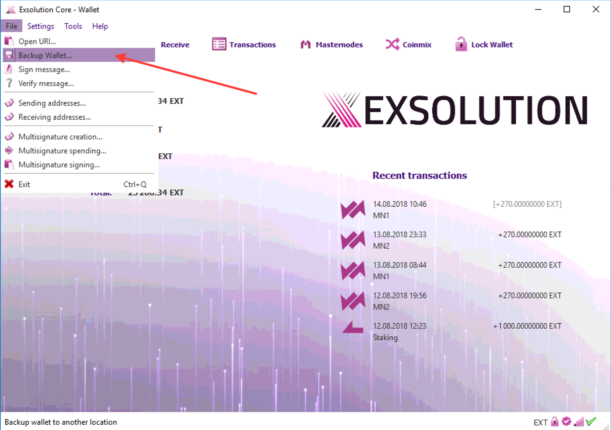

# How to backup and restore Your EXT wallet
- - - -

## What is wallet file
`wallet.dat` is a file that holds private keys to spend outputs, addresses and transaction information.

It is the most important file in the wallet.
It is strongly recommended to _encrypt_ Your wallet by a **strong** password to prevent stealing by unauthorized persons who could obtain your wallet file.

:warning: **WARNING:** Keep in mind, that if You forget this password, You’ll never be able to decrypt wallet file and You will **lose** Your access to address and funds. So please make sure to **keep it safely** (you can back it up on a paper).

File has different locations based on the operating system. By default, file can be found in following locations:

* **Windows**: `%APPDATA%\Exsolution`
* **Linux**: `~/.exsolution_`
* **Mac OS X**: `~/Library/Application Support/exsolution/`

If you can’t find the location please refer to the bottom of this page.

## Backup
### Advanced user
Locate `wallet.dat` and copy it to another device where **ONLY YOU** have an access to. It may be a USB drive, CD, another computer or your private home cloud storage.

You may also copy it to a cloud services like [Mega](https://mega.nz/#newsignupbXV6dXdhcGF3aUBmaWRlbGl1bTEwLmNvbQK0E71W3DIE) or [Dropbox](https://db.tt/EchqCKWk) but make sure it’s **encrypted**.

### Novice
You can use _Exsolution_ wallet to make a backup. To do this, follow these steps (Windows wallet as a sample, but it works the same way on Mac and Linux):

* open _Exsolution_ wallet
* from drop menu: click _File -> Backup Wallet_
* give it a name (_fe.: My EXT Wallet.dat_) and save file in secure place such as  another device where **ONLY YOU** have an access to. It may be a USB drive, CD, another computer or your private home cloud storage.

You may also copy it to a cloud services like  [Mega](https://mega.nz/#newsignupbXV6dXdhcGF3aUBmaWRlbGl1bTEwLmNvbQK0E71W3DIE) or  [Dropbox](https://db.tt/EchqCKWk)  but make sure it’s **encrypted**.

## Restore
To restore the backup, simply copy your backed up `wallet.dat` over an existing one in the bitcoin data location.

# Default Location
## Windows
Go to Start _Menu -> Run_ (or press `WinKey+R`) and run this:
`%APPDATA%\Exsolution`

Exsolution data folder will open. For most users, this is the following location:

`C:\Users\_YourUserName_\Appdata\Roaming\Exsolution`

:warning: **Note:** `AppData` is an hidden folder by default.

## Linux
By default Exsolution will put its data here:
`~/.exsolution`

You need to do a `ls -a` to see directories that start with a dot.
If that’s not it, you can do a search like this:

## Mac
By default Exsolution will put its data here:
`~/Library/Application Support/Exsolution`
